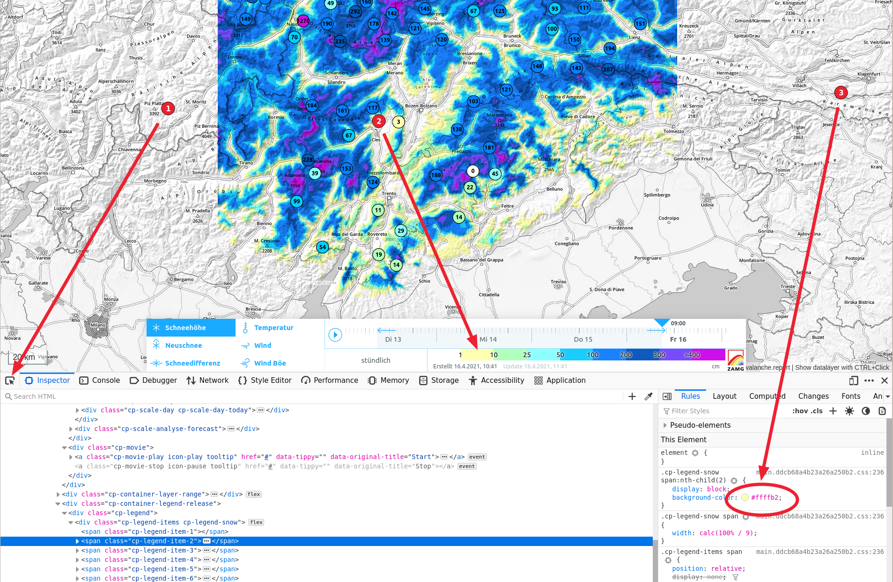
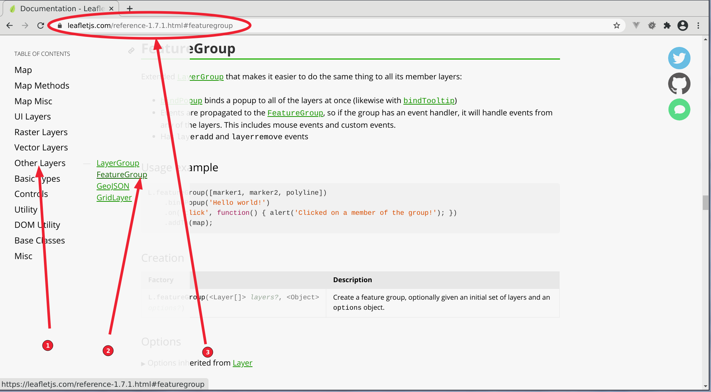

## Workload für die Woche vom 15. bis 22. April 2021

### AWS-Tirol Beispiel erweitern: Lufttemperatur-Layer

* Analog zum Schneehöhen-Layer soll ein weiterer Layer für die Lufttemperatur
  erzeugt werden.
* Dabei sollen nur Stationen angezeigt werden, die auch einen gültigen Wert für
  die Temperatur haben. **Achtung**: Die `if`-Abfrage, die wir bei den Schneehöhen
  verwendet haben wird hier nicht zum korrekten Ergebnis führen, da
  Temperatur-Werte mit `0` Grad dabei ausgeschlossen werden.
* Negative Temperaturen sollen blau, positive Temperaturen grün hinterlegt
  werden.

Natürlich sollen alle eure Schritte wie immer einzeln `committed` werden. Wir empfehlen auch die Verwendung des *Beautify*-Plugins (`F1`-*Beautify File*), oder der *Formatieren*-Funktion (`F1`-*Formatieren*) von VisualStudio-Code.

### Farb-Tabellen 

* Anhand der Vorlage von <https://webmapping21s.github.io/aws-tirol/colors.js>
sollen die fehlenden Farben für Temperatur und Schneehöhen in dieser Datei
ergänzt werden (kopiert die Datei `colors.js` in euer `aws-tirol`-Verzeichnis). Geht dazu
auf die Webseite <https://lawinen.report/weather/map/snow-height> und
verwendet das
*Inspector*-Werkzeug von den Browser Developer Tools (`F12`).

  

### Die Leaflet-Dokumentation kennen lernen

Wir werden uns während der nächsten Sitzung mit der Dokumentation der
*Leaflet*-Kartenbibliothek beschäftigen. In der Vorbereitung darauf möchten
wir, dass ihr die `main.js`-Datei von oben nach unten durchgeht und nach
allen Aufrufen sucht, die mit `L.` beginnen. Sucht dann auf der Webseite
<https://leafletjs.com/reference-1.7.1.html> den entsprechenen Eintrag und fügt eine Zeile hinzu,
die den Link zu dem Eintrag enthält.

Ein Beispiel:

```javascript
// https://leafletjs.com/reference-1.7.1.html#featuregroup     <--- hier einfügen
let awsLayer = L.featureGroup();
layerControl.addOverlay(awsLayer, "Wetterstationen Tirol");
```

Um die entsprechenden Links zu finden, verwendet das Menü oder die Browser-Suchfunktion auf der [API-Referenzseite](https://leafletjs.com/reference-1.7.1.html).



Bis spätestens **Donnerstag, 22. April 2021 mittags** sollen die drei Aufgaben erledigt sein.
